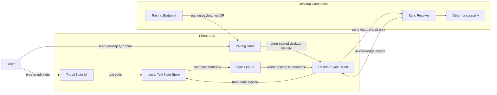

# Phone App High-Level Flow

This diagram shows the major moving pieces of the phone app at a very high level. It is meant as an orientation map, not a detailed implementation diagram.

Detailed diagrams for local storage, sync, and desktop handoff can be added later as separate files.

## Reading Notes

- The phone app owns typed capture, local text storage, and sync queueing.
- The sync handoff sends text and metadata only.
- Pairing is a one-time trust bootstrap. Future sync uses stored pairing credentials and must handle desktop IP address changes.
- The desktop companion owns receipt, processing, and eventual placement into the Obsidian vault.
- The phone marks a note as synced after the desktop companion acknowledges receipt.
