# Phone App High-Level Flow

This diagram shows the major moving pieces of the phone app at a very high level. It is meant as an orientation map, not a detailed implementation diagram.

Detailed diagrams for recording, transcription, local storage, sync, and desktop handoff can be added later as separate files.

```mermaid
flowchart LR
    user[User]

    subgraph phone[Phone App]
        ui[Note Capture UI]
        recorder[Audio Recording]
        tempAudio[Temporary Audio Working Data]
        transcriptionQueue[Transcription Queue]
        transcriptionEngine[On-Device Transcription]
        noteStore[Local Text Note Store]
        syncQueue[Sync Queue]
        syncClient[Desktop Sync Client]
    end

    subgraph desktop[Desktop Companion]
        receiver[Sync Receiver]
        other[Other functionality]
    end

    user -->|record or edit note| ui
    ui -->|start and stop recording| recorder
    recorder -->|stopped audio segment| tempAudio
    tempAudio -->|queue segment| transcriptionQueue
    transcriptionQueue -->|process locally| transcriptionEngine
    transcriptionEngine -->|insert transcript text| noteStore
    transcriptionEngine -->|delete after saved transcript| tempAudio
    ui -->|manual text edits| noteStore
    noteStore -->|text plus metadata| syncQueue
    syncQueue -->|when desktop is reachable| syncClient
    syncClient -->|send text payload only| receiver
    receiver -->|acknowledge receipt| syncClient
    receiver --> other
    syncClient -->|mark note synced| noteStore

    tempAudio -. not synced .-> receiver
```

## Reading Notes

- The phone app owns capture, temporary audio handling, on-device transcription, local text storage, and sync queueing.
- Audio is temporary working data. The sync handoff sends text and metadata only.
- Recording should become available again after a segment is queued, even if transcription is still running.
- The desktop companion owns receipt, processing, and eventual placement into the Obsidian vault.
- The phone marks a note as synced after the desktop companion acknowledges receipt.
